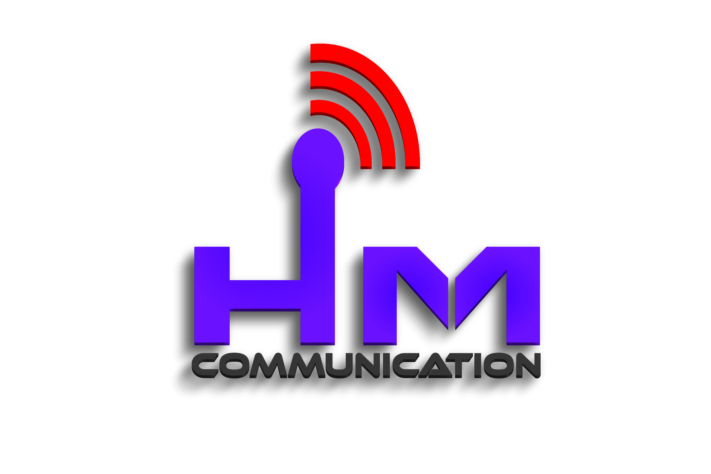

<div align="center">
  
  <h1>EDC ISP Monitoring System</h1>
  <p><strong>Real-time institutional connectivity monitoring via MikroTik RouterOS</strong></p>
  <p>
    
    
    
    
  </p>
</div>

---

## Overview

EDC Monitoring is a web-based ISP monitoring system that tracks the online/offline status of institutions by querying a MikroTik router via its API. Built with core PHP and MySQL, it provides real-time dashboards for admins and vendors with automated status logging.

## Features

- **Real-time Status Dashboard** — Green (online) / Red (offline) indicators with live auto-refresh
- **MikroTik API Integration** — Checks PPPoE Active sessions to determine connectivity
- **Role-Based Access** — Admin and Vendor panels with permission controls
- **Vendor Management** — Create vendors and assign specific institutions
- **Activity Logging** — Automatic logs when institutions go online/offline
- **Comment System** — Vendors can comment on institutions; admins reply
- **Multi-Theme UI** — Light, Dark, and Purple themes
- **Bengali Localization** — Full English/Bengali language toggle
- **Responsive Design** — Works on desktop and mobile

## Tech Stack

| Component | Technology |
|-----------|-----------|
| Backend | Core PHP (no framework) |
| Database | MySQL 5.7+ / MariaDB 10.3+ |
| Router API | MikroTik RouterOS API (raw TCP socket) |
| Frontend | Vanilla CSS + Vanilla JS |
| Fonts | Inter (Google Fonts) |

## Screenshots

<div align="center">
  
  
</div>

## Installation

### Requirements
- PHP 8.0+ with PDO MySQL extension
- MySQL 5.7+ or MariaDB 10.3+
- MikroTik RouterOS with API service enabled

### Quick Start

1. **Clone the repository**
   ```bash
   git clone https://github.com/yourusername/edc-monitoring.git
   cd edc-monitoring
   ```

2. **Set up the database**
   ```bash
   mysql -u root -p < database.sql
   ```

3. **Configure database connection**
   
   Edit `config/database.php`:
   ```php
   define('DB_HOST', 'localhost');
   define('DB_NAME', 'edc_monitoring');
   define('DB_USER', 'root');
   define('DB_PASS', 'your_password');
   ```

4. **Serve the application**
   
   Using PHP built-in server:
   ```bash
   php -S localhost:8000
   ```
   
   Or deploy to Apache/Nginx pointing to the project directory.

5. **Login**
   
   Navigate to `http://localhost:8000` and log in with:
   - **Username:** `admin`
   - **Password:** `admin123`

6. **Configure MikroTik**
   
   Go to **MT Settings** → enter your router IP, API port (default 8728), username, and password.

7. **Create vendors and institutions**
   
   Add vendors under **Vendors**, then assign institutions under **Institutions**.

### MikroTik API Setup

Enable the API service on your MikroTik router:

```
/ip service enable api
/user add name=api_user group=read password=your_password
```

> ⚠️ For production, use API-SSL (port 8729) or restrict API access by IP address.

### Cron Job (Auto-Sync)

Add this to your crontab to check status every minute:

```bash
* * * * * php /path/to/cron/sync.php >/dev/null 2>&1
```

On Windows, use Task Scheduler or the included loop script:

```bash
php cron/loop.php
```

## Project Structure

```
edc-monitoring/
├── admin/              # Admin panel pages
│   ├── dashboard.php   # Main dashboard with stats & filters
│   ├── institutions.php# Institution CRUD
│   ├── vendors.php     # Vendor CRUD
│   ├── settings.php    # MikroTik configuration
│   ├── logs.php        # Activity log viewer
│   ├── comments.php    # Comment management
│   └── admins.php      # User management (super admin)
├── api/                # AJAX endpoints
│   ├── sync.php        # Trigger full router sync
│   ├── status_bulk.php # Get all statuses (read-only)
│   ├── check_status.php# Check single institution
│   ├── test_mt.php     # Test MikroTik connection
│   ├── comments.php    # Comment CRUD
│   └── uptime.php      # Uptime statistics
├── assets/
│   ├── css/style.css   # Complete stylesheet (3 themes)
│   └── js/filter-dropdown.js  # Custom dropdown widget
├── config/
│   └── database.php    # Database credentials
├── cron/
│   ├── sync.php        # CLI sync script (cron)
│   └── loop.php        # Continuous loop (Windows)
├── includes/
│   ├── auth.php        # Session authentication
│   ├── db.php          # PDO database singleton
│   ├── functions.php   # Core business logic
│   ├── lang.php        # English/Bengali translations
│   ├── routeros_api.class.php  # MikroTik API client
│   └── sidebar.php     # Navigation sidebar
├── vendor/             # Vendor dashboard
├── index.php           # Landing page / router
├── login.php           # Login page
└── database.sql        # Database schema
```

## API Endpoints

| Endpoint | Method | Description |
|----------|--------|-------------|
| `/api/sync.php` | GET | Trigger full MikroTik sync (admin) |
| `/api/status_bulk.php` | GET | Get all institution statuses |
| `/api/check_status.php?id=X` | GET | Check single institution |
| `/api/test_mt.php` | GET | Test MikroTik connection |
| `/api/comments.php?action=list` | GET | List comments |
| `/api/comments.php` | POST | Add/delete comments |

## Security Notes

- ⚠️ Delete `install.php` after initial setup
- ⚠️ Change the default admin password immediately
- ⚠️ MikroTik API password is stored in plaintext in the database — use a dedicated read-only API user
- ⚠️ For production, add HTTPS and consider API-SSL (port 8729)

## Themes

The system includes three themes toggleable from the sidebar:

- **Light** — Clean white/gray palette
- **Dark** — Dark slate with indigo accents (default)
- **Purple** — Violet gradient theme

Language can be toggled between English and Bengali from the login page.

## License

MIT License — see [LICENSE](LICENSE) for details.

## Developer

**K.K.M. Fahad Fouzdar [CHAION]**
- 📞 8801711785635

---

<div align="center">
  <sub>Built with PHP, MySQL, and MikroTik RouterOS API</sub>
</div>
